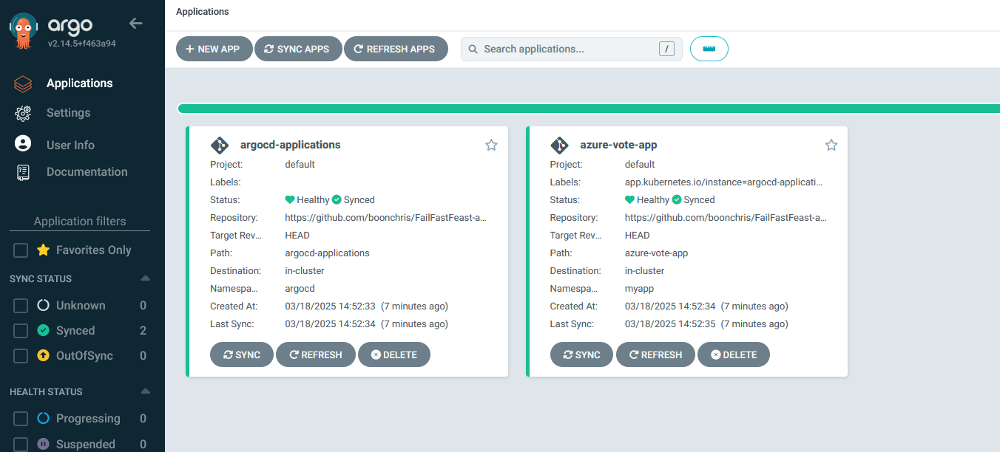
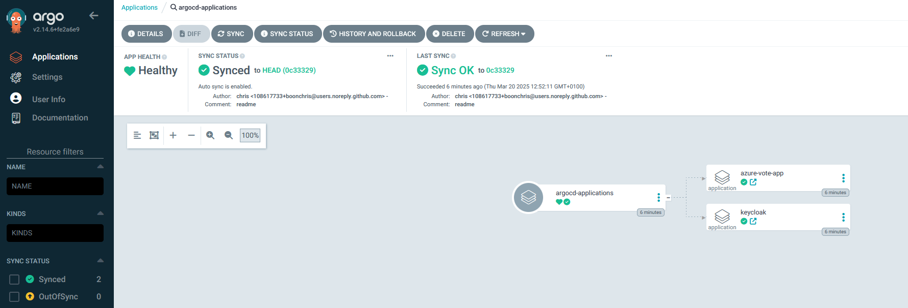
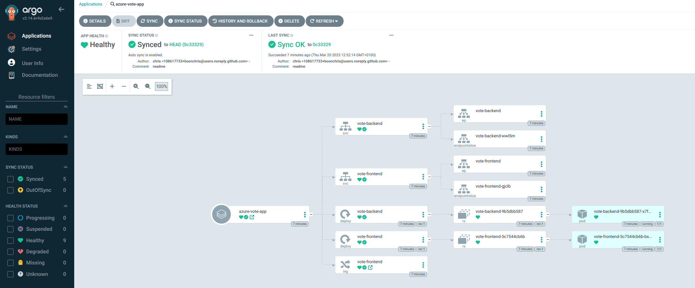
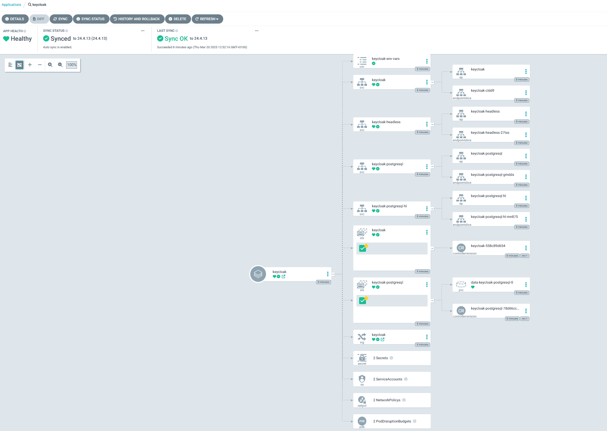
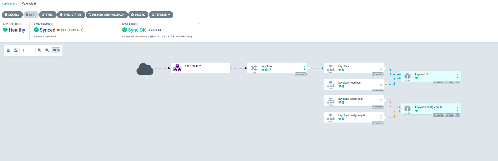

# Simple ArgoCD demo

This repo is used to demonstrate how to deploy a simple application using [ArgoCD](https://argo-cd.readthedocs.io/en/stable/).

## Our goal
The goal is to demonstrate the ease of use and power of ArgoCD. To achieve this, the repo contains an example of an [App Of Apps Pattern](https://argo-cd.readthedocs.io/en/latest/operator-manual/cluster-bootstrapping/). The parent application (defined in app-of-apps.yaml) configures ArgoCD to deploy any child applications that are defined in the ```argocd-applications``` directory.

## Prerequisites 

### Kubernetes cluster
This guide assumes you have a access to a (fresh) Kubernetes cluster. The steps in this demo can be applied on any type of Kubernetes Cluster.

#### minikube
If you want to create a local cluster (obviously not for production purposes), [Minikube](https://minikube.sigs.k8s.io/docs/) is a great option. I use this tool to run a local cluster on my Windows machine, using Podman in WSL2 to deploy the cluster (which runs in a container).

### Tools
Required CLI tools for this demo:
- [kubectl](https://kubernetes.io/docs/tasks/tools/install-kubectl-linux/)
- [argocd](https://argo-cd.readthedocs.io/en/stable/cli_installation/)

Both can be installed using brew
```bash
brew install kubernetes-cli
brew install argocd
```

## Deploying ArgoCD

Make sure your fresh cluster is ready and check if your kubeconfig is set up correctly by running
```bash
kubectl get pods -A
```

We are now going to create a namespace for ArgoCD and install ArgoCD in the new namespace.
```bash
kubectl create namespace argocd
kubectl apply -n argocd -f https://raw.githubusercontent.com/argoproj/argo-cd/stable/manifests/install.yaml
```

It might take a minute before ArgoCD has started. Check if all the pods have started by running
```bash
kubectl get pods -n argocd
```

ArgoCD auto-generates an initial password for the admin account. This password should be changed immediately in real-world clusters. Retrieve the password by running the command below and copy the result. 
```bash
argocd admin initial-password -n argocd
```

Check the service ports and port-forward the ArgoCD frontend to port 8080. This allows you to access the ArgoCD UI from your browser. 
```bash
kubectl get svc -n argocd
kubectl port-forward -n argocd svc/argocd-server 8080:443
```

Copy the forwarded address and open it in your browser. Skip the warning about the invalid certificate (we have not configured this) and advance to the ArgoCD UI. Enter username ```admin``` and the previously copied password. You will now be greeted with the (empty) User Interface.

Change the admin password User Info (Left-hand menu) > Update Password

It's now time to look at our parent application (app-of-apps.yaml). This file instructs ArgoCD to monitor the argocd-applications directory in this repository and deploys any applications defined within it. I have added comments in the yaml to explain what is configured. 

In your shell, navigate to the root of this repository and run:
```bash
kubectl apply -f https://raw.githubusercontent.com/boonchris/argocd-demo/main/app-of-apps.yaml
```

ArgoCD will now deploy all applications defined in the argocd-applications directory. This includes:
- The Azure Vote App (frontend and backend) based on the manifests in the azure-vote-app directory of this repository
- Keycloak and its components based on the native Helm chart in the keycloak directory
- Nginx Ingress Controller based on ArgoCD's declarative method of deploying Helm Charts in ingress-controller.yaml

**Note:** If you manage your entire cluster using ArgoCD, this was probably the last time you needed to run kubectl apply on your cluster. 

After deployment, the ArgoCD UI will show two applications: the parent and the child application. 


The app-of-apps (parent application) will look like this.


The child applications can be viewed individually as well. This shows a more detailed view, as it shows all kubernetes resources within the application.

By default, you will see a tree view with all the resources.

Tree view for the Azure Vote App:


The same view for our Keycloak deployment:


ArgoCD offers alternative views as well, for example the Network view:


## References

The following resources are very useful when learning about ArgoCD:
- [ArgoCD: Getting Started](https://argo-cd.readthedocs.io/en/stable/getting_started/#1-install-argo-cd)
- [What is GitOps, How GitOps works and Why it's so useful - TechWorld with Nana, 11:32](https://www.youtube.com/watch?v=f5EpcWp0THw)
- [ArgoCD Tutorial for Beginners | GitOps CD for Kubernetes - TechWorld with Nana, 47:52](https://www.youtube.com/watch?v=MeU5_k9ssrs)
- [Minikube Windows Installation](https://minikube.sigs.k8s.io/docs/start/?arch=%2Fwindows%2Fx86-64%2Fstable%2F.exe+download)
- [Podman Windows Installation](https://github.com/containers/podman/blob/main/docs/tutorials/podman-for-windows.md)

The initial excercise to deploy an application in k8s was forked from [FailFastFeast](https://github.com/jpvdham/FailFastFeast).