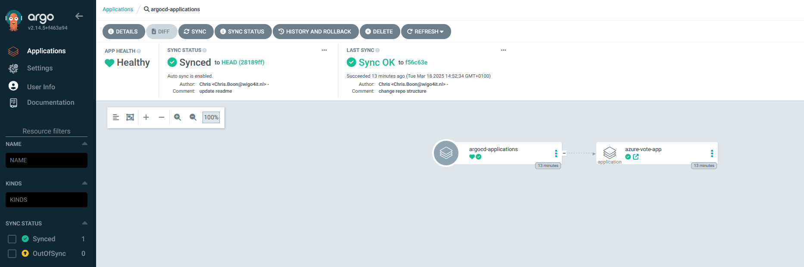
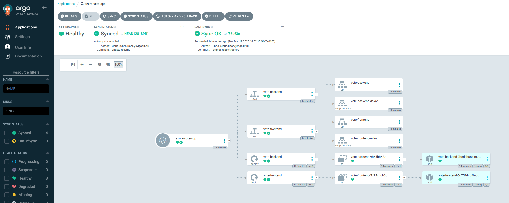

# Simple ArgoCD demo

This repo is used to demonstrate how to deploy a simple application using [ArgoCD](https://argo-cd.readthedocs.io/en/stable/). 

## Our goal
To properly demonstrate the power of ArgoCD, this repo contains an example of an [App Of Apps Pattern](https://argo-cd.readthedocs.io/en/latest/operator-manual/cluster-bootstrapping/). The parent app (defined in argocd-applications.yaml) makes sure any child apps will be deployed by ArgoCD. 

After deployment, the ArgoCD UI will show two applications: the parent and the child application. 


The parent application will look like this.


The child application shows a more detailed view, as it contains 2 deployments and 2 services.


## Prerequisites 

### Kubernetes cluster
This guide assumes you have a access to a (fresh) Kubernetes cluster. The steps in this demo can be applied on any type of Kubernetes Cluster.

I use a local Minikube cluster on my Windows machine, using Podman in WSL2 to manage the container. I copied the Kubeconfig from Windows to my WSL so I can access the cluster from my trusted WSL shell.

### Tools
Required CLI tools for this demo:
- [kubectl](https://kubernetes.io/docs/tasks/tools/install-kubectl-linux/)
- [argocd](https://argo-cd.readthedocs.io/en/stable/cli_installation/)

Both can be installed using brew
```bash
brew install kubernetes-cli
brew install argocd
```

## Deploying ArgoCD
Clone this repository so you can access it from your shell.

Create a namespace and install ArgoCD in your cluster
```bash
kubectl create namespace argocd
kubectl apply -n argocd -f https://raw.githubusercontent.com/argoproj/argo-cd/stable/manifests/install.yaml
```

Check if all the pods have started.
```bash
kubectl get pods -n argocd
```

ArgoCD auto-generates an initial password for the admin account. Retrieve the password. This password must always be changed immediately in real-world clusters. 
```bash
argocd admin initial-password -n argocd
```

Check the service ports and port-forward the ArgoCD frontend to port 8080
```bash
kubectl get svc -n argocd
kubectl port-forward -n argocd svc/argocd-server 8080:443
```

Copy the forwarded address and open it in your browser. Skip the warning about the invalid certificate (we have not configured this) and advance to the ArgoCD UI. Use username ```admin``` the previously copied password. You will now be greeted with an empty User Interface.

It's now time to deploy our first application, which monitors this repository and deploys any applications defined within it. In your shell, navigate to the root of this repository and run.
```bash
kubectl apply -f argocd-applications.yaml
```
ArgoCD will now all applications defined in the argocd-applications directory. This includes the frontend and backend based on the manifests in the azure-vote-app directory of this repository. 

## References

The following resources are very useful when learning about ArgoCD:
- [ArgoCD: Getting Started](https://argo-cd.readthedocs.io/en/stable/getting_started/#1-install-argo-cd)
- [What is GitOps, How GitOps works and Why it's so useful - TechWorld with Nana, 11:32](https://www.youtube.com/watch?v=f5EpcWp0THw)
- [ArgoCD Tutorial for Beginners | GitOps CD for Kubernetes - TechWorld with Nana, 47:52](https://www.youtube.com/watch?v=MeU5_k9ssrs)
- [Minikube Windows Installation](https://minikube.sigs.k8s.io/docs/start/?arch=%2Fwindows%2Fx86-64%2Fstable%2F.exe+download)
- [Podman Windows Installation](https://github.com/containers/podman/blob/main/docs/tutorials/podman-for-windows.md)
